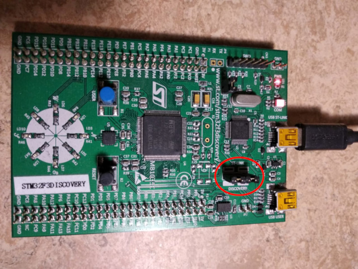

# 安装验证

在这个章节中我们将检查工具和驱动是否已经被正确地安装和配置了。

使用一个micro USB线缆将你的笔记本/个人电脑连接到discovery开发板上。discovery开发板有两个USB连接器；使用标记着"USB ST-LINK"的那个，它位于开发板边缘的中间位置。

也要检查下ST-LINK的短路帽被安装了。看下面的图；ST-LINK短路帽用红色圈起来了。

<p align="center">

</p>

现在运行下面的命令:

``` console
openocd -f interface/stlink.cfg -f target/stm32f3x.cfg
```

> **注意**: 旧版的openocd, 包括从2017发布的0.10.0, 不包含新的(且更适合的)`interface/stlink.cfg`文件； 你需要使用`interface/stlink-v2.cfg` 或者 `interface/stlink-v2-1.cfg`。
 

你应该看到下列的输出，且程序应该阻塞住了控制台:

``` text
Open On-Chip Debugger 0.10.0
Licensed under GNU GPL v2
For bug reports, read
        http://openocd.org/doc/doxygen/bugs.html
Info : auto-selecting first available session transport "hla_swd". To override use 'transport select <transport>'.
adapter speed: 1000 kHz
adapter_nsrst_delay: 100
Info : The selected transport took over low-level target control. The results might differ compared to plain JTAG/SWD
none separate
Info : Unable to match requested speed 1000 kHz, using 950 kHz
Info : Unable to match requested speed 1000 kHz, using 950 kHz
Info : clock speed 950 kHz
Info : STLINK v2 JTAG v27 API v2 SWIM v15 VID 0x0483 PID 0x374B
Info : using stlink api v2
Info : Target voltage: 2.919881
Info : stm32f3x.cpu: hardware has 6 breakpoints, 4 watchpoints
```

内容可能并不是一模一样，但是在最后一行，你应该看到了breakpoints和watchpoints，如果你看到了，那就终止OpenOCD进程然后进入[下个章节]

[下个章节]: ../../start/index.md

如果你没看到"breakpoints"这行，尝试下下列命令中的某一个。

``` console
openocd -f interface/stlink-v2.cfg -f target/stm32f3x.cfg
```

``` console
openocd -f interface/stlink-v2-1.cfg -f target/stm32f3x.cfg
```

如果这些命令的某条起作用了，那意味着你使用的discovery开发板是一个旧的版本。那也不成问题，但是你要记住这件事，因为随后你可能需要点不同的配置。你可以移到[下个章节]了。

如果这些命令在normal user模式下都没用，尝试下使用root模式运行它们(e.g. `sudo openocd ..`)。如果命令在root模式下起作用，要检查下[udev rules]是否被正确地设置了。

[udev rules]: linux.md#udev-rules

如果这些都试了，OpenOCD还不工作，请打开一个[issue]，我们将帮助你！

[issue]: https://github.com/rust-embedded/book/issues
